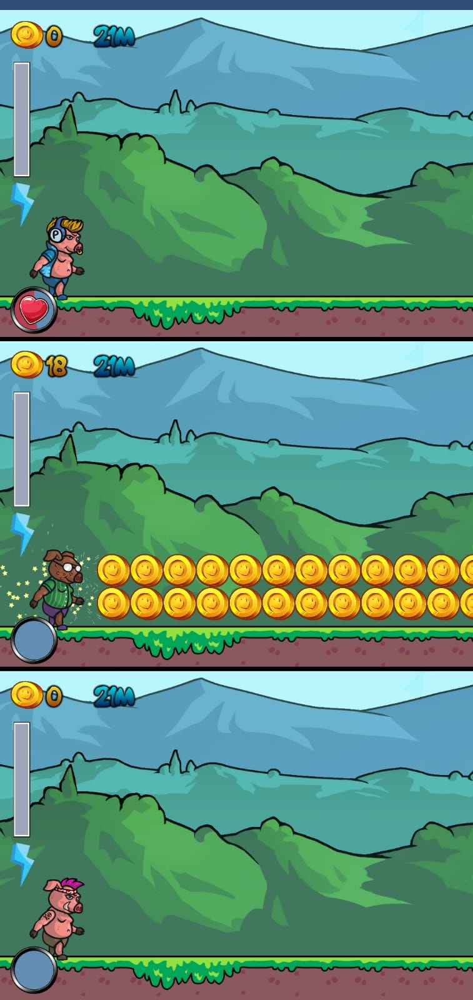
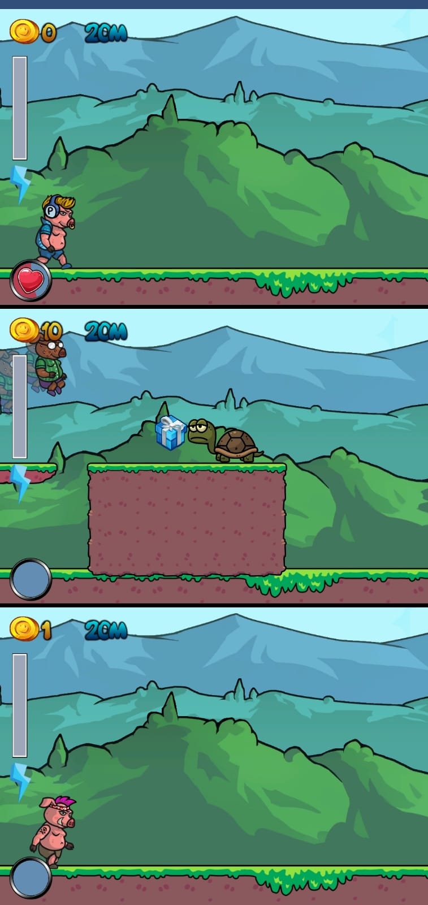
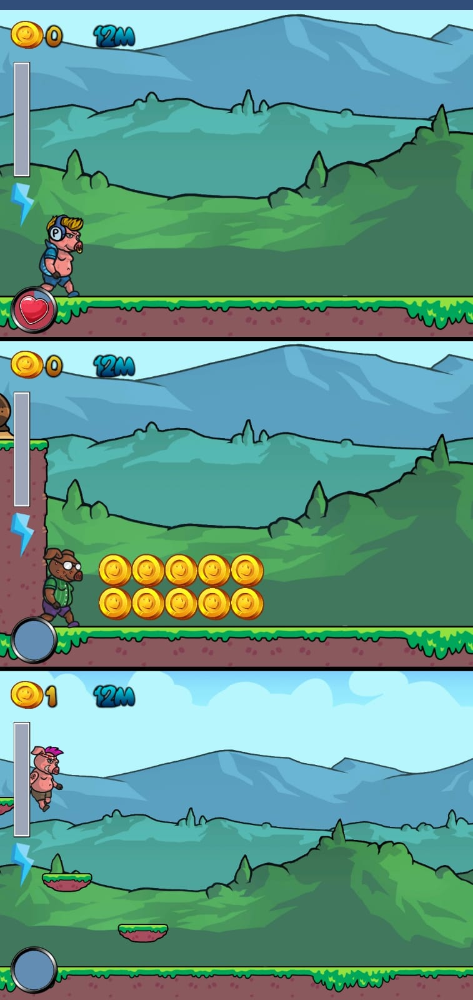
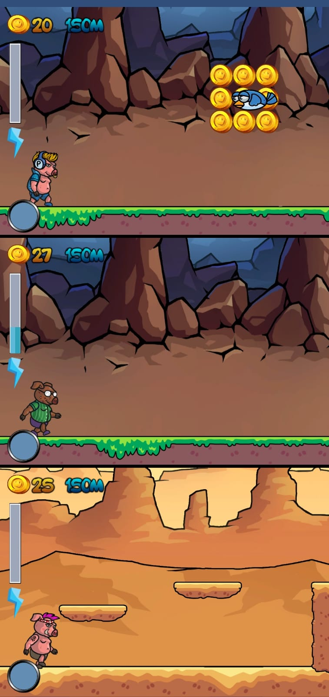
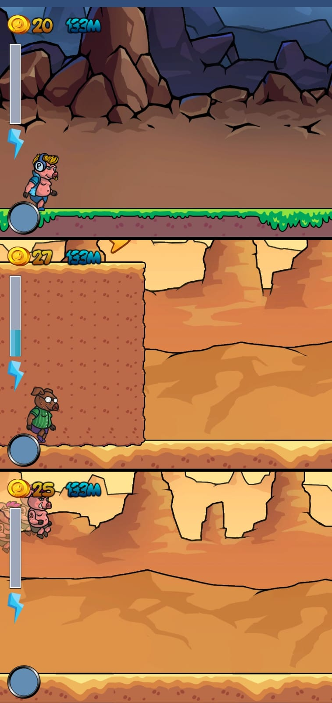
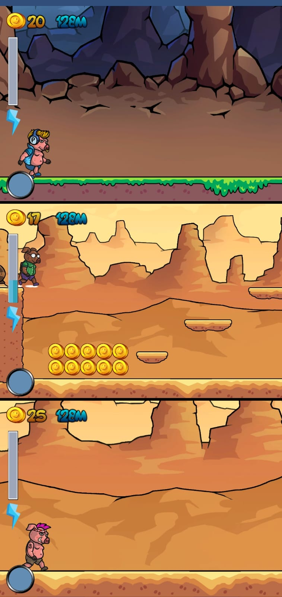
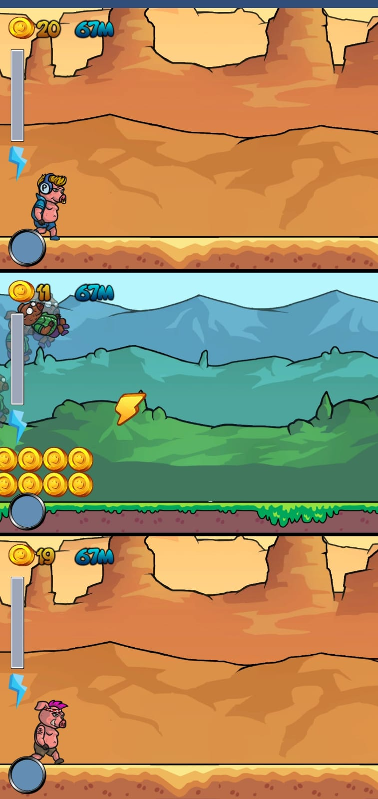
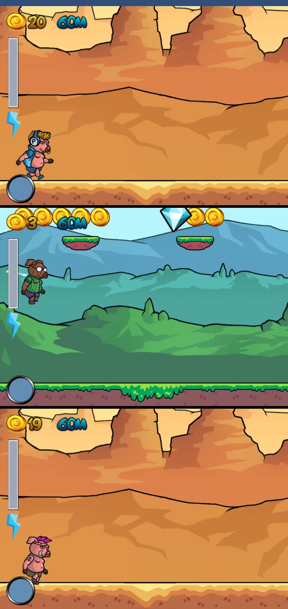

# PiggyRun_Code

This is not a full Unity3D project, so it won't be possible to build. Code provided for reference.  

## License
This project is licensed under the MIT License.

## Presentation

  
Click to expand

  
  
  
  
  
  
  
  

